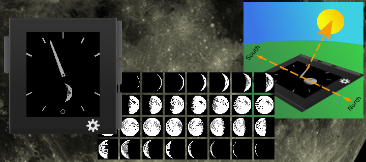
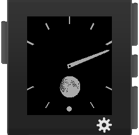

Pebble Decelerate Northern Hemisphere
=====================================

A sample project for the Pebble Smart Watch
using [pebble sdk 3.0](https://developer.getpebble.com/sdk)

* Decelerate your day with a less stressful time display
* Exact time is shown by analog hour hand only.
* Additional feature is the display of the current Moon phase

_The Decelerate Northern Hemisphere watchface shows a single hour hand only.
Midnight is on bottom of the clockface while Noon is indicated on top.
One rotation of the hour hand takes a whole day._

_An indicator for the seconds is blinking on bottom of the watchface._

# Compass Feature

If holding the Pebble watch parallel over ground and turning it so the
hour hand is pointing towards the sun then top of the watch face will
always point in south direction and bottom of watch face in north
direction on northern hemisphere (Compass feature).

Mind the observers position: _The compass feature is
basically depending on the users (or better the observers)
position on Earth - respectively the latitude of
the observing position. At higher latitudes the compass feature
is easier to use and more fail safe. Assumed both the Earth's
orbital plane around the sun and the Earth's equatorial plane
would match each other (so the angle is assumed to be 0 degrees
instead of approximately 23.5 degrees) this would mean that
an observer standing at any position of the equator
will not have a preferred view during noon to point the hour hand
towards the sun holding the watch parallel over ground. Meaning the
compass feature is not working at observer positions with smaller
latitudes._

Mind the difference of southern hemisphere and northern hemisphere:
_On southern hemisphere top of the watch face will indicate north
direction while bottom of watch face is oriented south._ 

# Moon Phase Display

_Additionally the current Moon phase is shown for
northern hemisphere. Moon phase display is expected to work until end of
Unix Time (overflow on Jan 19th, 2038 03:14:07 GMT) at least as
implemented here. For simplicity the axis of the Moon is shown
vertically on the watch face only._

Mind that observer will have a preferred viewing direction:
_The Moon's view on the sky might vary from upright vertical
orientation being rotated by an amount depending on latitude
and the current position of the sun. Restricted to observer's
location and latitude it shows itself close to upside down
between both hemispheres in direct comparison. The
inclination of the Moon's orbital plane towards the
plane of the Earth's equator has an
angle of approximately 5 degrees. For
simplicity assume that the Moon's orbital
plane equals the plane of the Earth's equator
neglecting the about 5 degrees angle. Such that on northern
hemisphere the Moon will always appear in south direction with
an observer usually and conveniently looking southward. On
southern hemisphere vice versa just the other way around.
Due to symmetry reason with an observer being near equator
there is less preference or convenience for one of the
directions. The orientation of the crescent Moon can simlpy
be swapped by an upwards looking observer turning in opposite
direction then._

_Anyway the Moon's crescent always points towards the sun._

# Legal

See file named LICENSE being part of the repository.

Copyright (c) 2015

* __@AUTHOR__ Oliver Merkel, Merkel(dot)Oliver(at)web(dot)de.

All rights reserved.

Brands, logos and trademarks belong to their respective owners.

# Credits to

* [NASA (National Aeronautics and Space Administration)](http://www.nasa.gov) for the _public domain images_ provided
    * [NASA Freedom of Information Act (FOIA)](http://www.nasa.gov/FOIA/index.html)
    * [Images](http://moon.nasa.gov/images.cfm) and [data](http://www.nasa.gov/moon) about the Earth's Moon
    * [Galileo spacecraft returned images of the Moon](http://photojournal.jpl.nasa.gov/catalog/PIA00405)
    * [JPL Image Use Policy](http://www.jpl.nasa.gov/imagepolicy)

Thank you!
